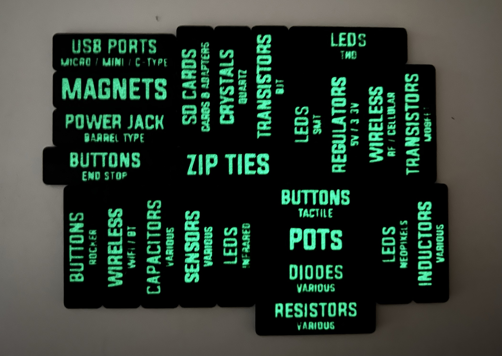

# Multi Color 3D Printed Labels 

So, you want to create 3D printed labels but you hate the tedious workflow on your MCAD software? No worries! You can generate them instead.

This project uses OpenSCAD, Python, and a Spreadsheet to generate labels that are easy to 3D print.

All you need to do is follow these steps:

## 0. Install Pre-requisites

Make sure you have the following software on your machine:

1. [OpenSCAD](https://openscad.org/downloads.html)
2. [Python 3](https://www.python.org/downloads/)
3. [SuperSlicer](https://github.com/supermerill/SuperSlicer) or similar


## 1. Define a CSV file two columns: Title, Subtitle

Create a CSV file using your favorite spreadsheet software or if you are brave enough, just write it in your favorite code editor. Your data schema should look something like this: [labels.csv](labels.csv)

**Notes:**

- Make sure your CSV file is valid, and has a header row on the top. The generator will generate the lables from the 1st row to the N-th row where N = 8*3 = 24. You can increase or decrease this limit in the next step.

## 2. Clone this Project, and generate STL files

Once you clone this repo, and replace the `labels.csv` file with your new CSV data file. Then, run the following command to generate labels:

```sh
bash GenerateLabels.sh
```

You should now have 3 `.stl` files in the `STLs` directory. Verify that they exist, and also check that none of the labels are overflowing by opening and previewing `tmp/preview.scad` file in OpenSCAD. If you are not satisfied, shorten the lables and re-run the script, or move to the next step.


**Notes:**

- The above command might fail if your `$OPENSCAD_CMD` variable is not set correctly. I have set this correctly for my Mac, but it might not work for yours. Please change the varible to a correct command line path of `openscad`, or just open the `.scad` files from `tmp` directory, and export them to STL from OpenSCAD GUI.

- You might see a warning: `unknown element "blank"`. Just ignore that and let the command complete. It may take a few minutes to complete the render and generate the STL files. Sample command line output: [output.txt](output.txt)

- The above command will generate a grid of 8x3 which needs 16.1cm x 16.1cm, which should work for majority of 3D printers. I am using Prusa MK3S+ with MMU2S, 8x3 works perfectly for me. Given that I also need to leave some space for the purge block. Change this settings by modifying `grid_row` and `grid_cols` variable in `GenerateLabels.py` if you have a different requirement.

- The generated STL files will be upside down because the lables should be printed upside down. This will save filament by reducing the size of the purge block if you are using a Multi-Material Unit (MMU).


## 3. Slice & Print

Import the 3 STL files in the Slicer Software as parts of a single object. They should position themselves properly relative to one another. This works well in PrusaSlicer, and therefore it should work in SuperSlicer. You need to have a Multi Extruder Printer setup, like a MMU or something similar.

Infact, you can just drag and drop the generated STL files, and PrusaSlicer will ask you if it should consider it as a multi-part object.


**Color Selection**

We have generated 3 STL files in the [STLs](STLs/) directory: `text.stl`, `bg.stl`, `core.stl`. 

- `text.stl` is your label text.
- `bg.stl` is the color contrasting your label.
- `core.stl` is right behind the above objects.

Here is a quick animation to demonstate which part is what.


If you don't have any special requirement, `text.stl` will have the color you want to use for the text on the labels, for example white. And `bg.stl`, `core.stl` should have a contrasting color, for example black. 

However, if you want to print the labels in glow-in-the-dark filament; and given that the glow-in-the-dark filament is usually translucent when not activated, its going to take the color of the filament behind it. And your labels will not be visibile in light. To fix that, you should use contrasting colors for `bg.stl` and `core.stl` if you are using glow-in-the-dark filament for `text.stl`. Or use contrasting colors for `text.stl` and `core.stl` if you are using glow-in-the-dark filament for `bg.stl`. Moreover, you will need more solid layers in the bottom than normal, because you don't want `core.stl` to start as a infill. I went with 10 solid bottom layers of 0.2mm each. Alternatively, you can just do 100% infill.
